Link to Jupyter Notebook on GitHub:
https://github.com/jakep3/project3_earthquakes/blob/master/Project_3_Earthquakes.ipynb

Jake Philpott

BME 450

3/1/2020

                                        Project 3: Plate Tectonics Assignment

__PROBLEM STATEMENT__ 

The purpose of this project was to evaluate earthquake data in the NE Pacific Ocean. The region covered includes the Juan de Fuca Plate. From the data, analysis was made to discuss patterns and trends in the magnitude and location of earthquakes over a specified time frame. The time frame of interest was January 1st, 2010 to February 24th, 2020. Also, tectonic plate boundaries were evaluated for their earthquake magnitudes. There were two parts to this project regarding analysis and they will be described as follows. 

Part I: Plate Boundary Feature

1.	Plot (scatter plot) earthquake magnitude vs time.
2.	Show earthquake locations (lat and lon) on a map by circles. The radius of these circles should be proportional to the earthquake magnitude. 
3.	Answer these questions:

      a.	Across what geographic area are you able to observe earthquake data in this map? Why do you see most of the earthquakes in that area? 
      
      b.	 What is the range of earthquake size (magnitude) in the data? What is the average earthquake size in this area? 
      
      c.	Map the earthquakes in April 2015. Where are those earthquakes mostly located? What event can you link these earthquakes to?

Part II: Divergent Boundary vs Transform Boundary 

1.	Identify a divergent boundary and a transform boundary on the map you selected in Part I and repeat steps 1 and 2 of Part I. 
2.	 Answer this question: 

     a.	What kind of patterns in earthquake magnitude and location do you observe over time along each boundary?

__BACKGROUND__ 

The Earth’s surface is made up of many tectonic plates, which are always moving relative to one another. Three tectonic plates of interest for this project are the North American Plate, the Pacific Plate, and the Juan de Fuca Plate. At the boundaries between the plates, there is a lot of stress build up which is where earthquakes often occur from the release of energy [1]. Plates have different boundary names (divergent, convergent, or transform), depending on the motion the two plates have with each other. A divergent boundary is one where two plates are pushed apart from each other at the boundary line [2]. A convergent boundary is one where the plates move toward each other at the boundary line [2]. A transform boundary is one where the plates move past each other in the same plane in opposite directions [2]. The Juan De Fuca Plate, the Pacific Plate, and the North American Plate have all three types of boundaries as can be seen in Figure 1 [3]. Also it should be noted that the Juan de Fuca Plate is segmented into three segments, with the Explorer Plate as the northern segment, and the Gorda Plate as the southern segment [4].

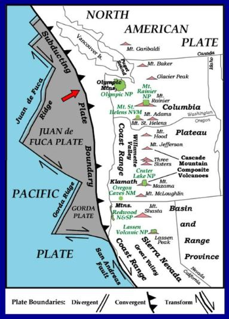

__Figure 1:__ the tectonic plates of the NE Pacific Ocean.

__SOLUTION__

The solution involved requesting custom data from the USGS Earthquake Catalog [5]. For this project, the minimum earthquake magnitude was set to 2.5, and the date range was from January 1st, 2010 to February 24th, 2020. The data was downloaded as a CSV file and uploaded to GitHub. Then, the data was used in Jupyter Notebook in order to create plots, maps, and perform analysis. The analysis allowed for trends to be discovered which allowed for answers to the project questions.

__RESULTS__

The results from the data analysis for Part I and Part II are to follow, for earthquake data in the NE Pacific Ocean from January 1st, 2010 to Februarys 24th, 2020. 

Part I: Plate Boundary Features 

1.	The scatter plot of earthquake magnitude vs time for the full set of data can be seen in Figure 2. The full data set is from a selected rectangular region with latitudes: 52.107 and 38.891, and longitudes: -131.836 and -122.168.

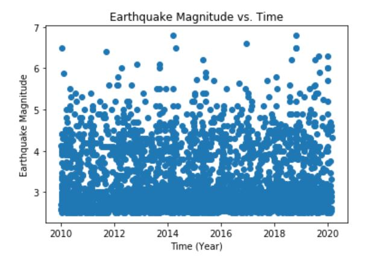

__Figure 2:__ The Earthquake Magnitude vs Time for the full data set.
 
 
2.	The earthquake locations are shown on a map in Figure 3. The circle sizes are proportional to the earthquake magnitudes.

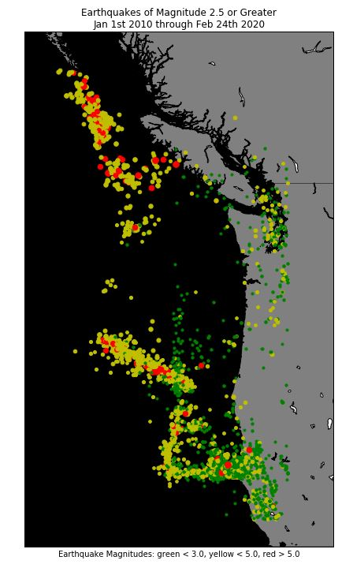

__Figure 3:__ A map of the NE Pacific Ocean with the earthquakes plotted for the full data set. 

3.	Answers to the questions:

  a.	By comparing Figure 1 and the map in Figure 3, I observe earthquake data on the boundaries between the tectonic plates. The tectonic plates for this data set include the Juan de Fuca Plate, the Pacific Plate, the North American Plate, the Gorda Plate, and the Explorer Plate. Most of the earthquakes are seen along the plate boundaries because boundaries are where the tectonic plates move away from each other, toward each other, and slide past each other. The tectonic plate movement discharges a lot of energy which causes the vibrations we feel and classify as earthquakes.

  b.	The range of earthquake size is 2.5 to 6.8 in magnitude. The average earthquake size, taken from the mean of the data collected, is 3.24 in magnitude. 

  c.	For the same region, a map of the earthquakes for data in only April 2015 can be seen in Figure 4. The majority of the midsized earthquakes are in a close group off the coast of Oregon, along the Juan de Fuca Ridge, which is the boarder of the Juan de Fuca Plate and the Pacific Plate. There is an Axial Volcano in that location. These earthquakes can be linked to the eruption of the Axial Seamount, Juan de Fuca Ridge, which was captured in real time by the seafloor seismic and acoustic instruments deployed by the Ocean Observatories Initiative cabled array [6]. Figure 5 shows the location of the Axial Volcano [7]. 

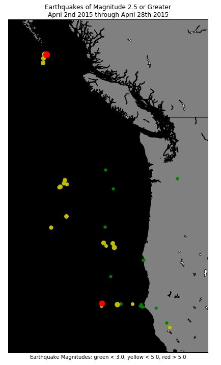

__Figure 4:__ The earthquake data for April 2015.
 
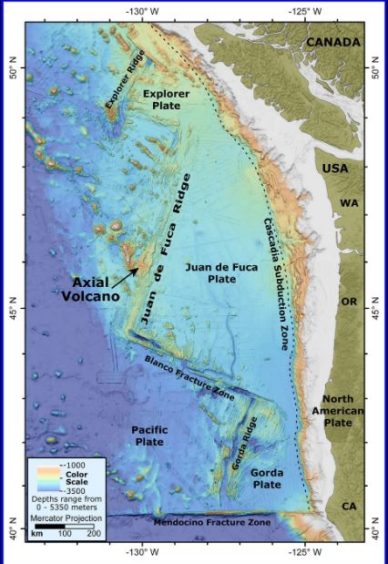

__Figure 5:__ This shows the location of the Axial Volcano, which corresponds to the group of earthquakes viewed in Figure 4. 

Part II: Divergent Boundary vs Transform Boundary
1.	By comparing Figure 1 and Figure 3, it was possible to identify a divergent boundary and a transform boundary for the full data set from Part I. Figure 6 below shows the identified regions. The Gorda Ridge is the divergent boundary, and the Blanco Fracture Zone is the transform boundary. 
 
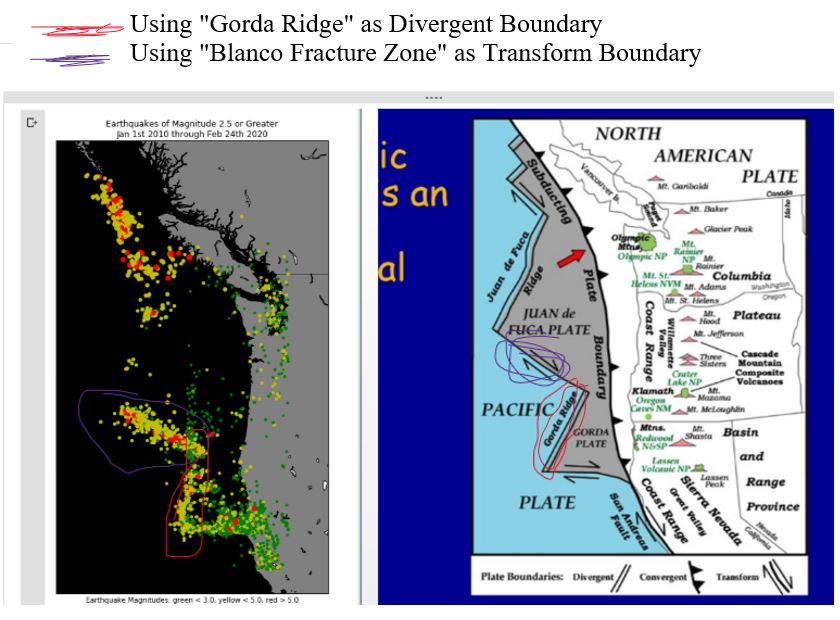

__Figure 6:__ Comparing the data from the USGS with an image that identifies the plate boundaries in the NE Pacific Ocean. The Blanco Fracture Zone is named on Figure 5.

Next, for the identified regions, steps 1 and 2 of Part I will be repeated. Figures 7 and 8(a, b) will be steps 1 and 2 respectively, for the divergent boundary. Figures 9 and 10(a, b) will be steps 1 and 2 respectively for the transform boundary. 

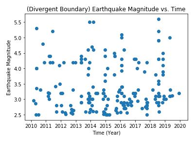

__Figure 7:__ Earthquake magnitude vs time for the divergent boundary.
 
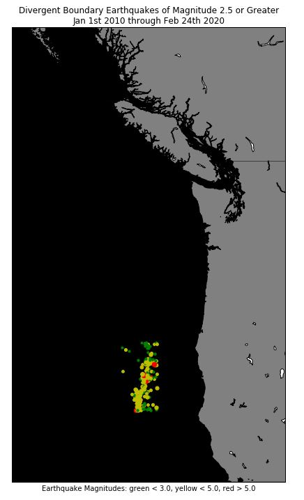

__Figure 8a:__ The divergent boundary isolate on the map. (Gorda Ridge) The data set is from a selected rectangular region with latitudes: 43.025 and 40.614, and longitudes: -128.024 and -126.343.

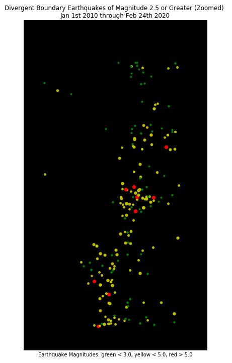

__Figure 8b:__ Zoomed in version of the map of the divergent boundary. (Gorda Ridge)

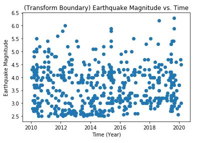

__Figure 9:__ Earthquake magnitude vs time for the transform boundary.

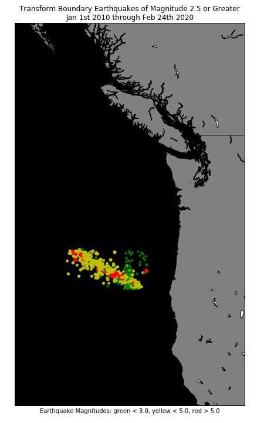 

__Figure 10a:__ The transform boundary isolate on the map. (Blanco Fracture Zone) The data set is from a selected rectangular region with latitudes: 44.598 and 42.997, and longitudes: -130.364 and -125.760.

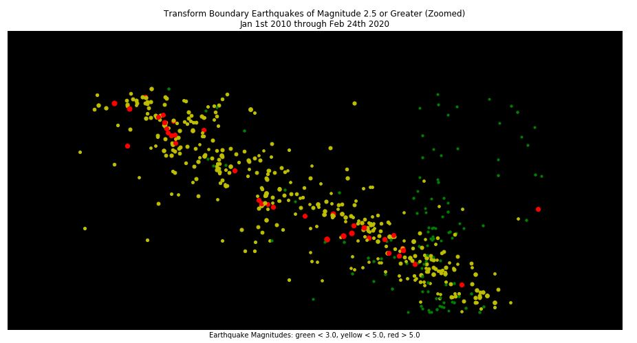
__Figure 10b:__ Zoomed in version of the map of the transform boundary. (Blanco Fracture Zone)

2.	 Answers to the question: 

  a.	For the divergent boundary, the pattern for earthquake magnitude over time appears to be that there are a lot of small magnitude earthquakes (3.5 and smaller) throughout each year, as can be seen in Figure 7. Larger earthquakes (5+ magnitude) in this area are few and far between. For location over time, the pattern appears to be that earthquakes occur in the same areas, almost like clusters indicating that some regions are more prone to earthquakes. As time goes on, the same areas along the boundary are having the most earthquakes. Location can be seen in Figure 8b.   
For the transform boundary, the pattern for earthquake magnitude over time appears to be that there are a large number of earthquakes with magnitudes in the 2.5 to 5.0 range. This indicates that this region is more prone the higher magnitude earthquakes throughout each year, with the supporting data seen in Figure 9. For location of the earthquakes over tie, the pattern appears to be that the earthquakes and magnitude of earthquakes are evenly spread along a linear path on the boundary. The region as a whole experiences the earthquakes rather than just clusters of the area. The path can be seen in Figure 10b. 
 
 
__CONCLUSIONS__ 

The purpose of this project was to evaluate earthquake data in the NE Pacific Ocean. The region covered includes the Juan de Fuca Plate. From the data, analysis was made to discuss patterns and trends in the magnitude and location of earthquakes from January 1st, 2010 to February 24th, 2020. Also, tectonic plate boundaries were evaluated for their earthquake magnitudes. To briefly recap on the results; earthquake data is observed typically on the boundaries of two tectonic plates because of the energy build up and energy dispersion from plate movement. Also, it was observed that some earthquakes in April 2015 were from the underwater volcano eruption, the Axial Seamount. Results also indicated that the earthquake magnitudes, frequency, and location behavior differ for different boundary types. The divergent boundaries have frequent low magnitude earthquakes that appear to occur in clusters, while the transform boundaries have frequency higher magnitude earthquakes that occur evenly along the boundary line. One take away from the project is that earthquake data provides valuable information for illustrating tectonic plate boundaries, and understanding how the earth moves; which can also work in the reverse in that understanding the tectonic plate movement can help predict future earthquakes which can help keep people safe. 
 
 
__REFERENCES__

[1] 	"Why and where do earthquakes occur?," British Geological Survey, [Online]. Available: https://www.bgs.ac.uk/discoveringGeology/hazards/earthquakes/whyWhere.html. [Accessed 29 February 2020].

[2] 	"Plate tectonics," British Geological Survey, [Online]. Available: https://www.bgs.ac.uk/discoveringGeology/hazards/earthquakes/plateTectonics.html. [Accessed 29 February 2020].

[3] 	M. Gilmore, "The Pacific Northwest is an active continental margin," 2019.

[4] 	J. A. DiPietro, Cascadia Volcanic Arc System, 2013. 

[5] 	USGS, "Earthquake Hazards Program," [Online]. Available: https://earthquake.usgs.gov/earthquakes/search/#%7B%22autoUpdate%22%3A%5B%22autoUpdate%22%5D%2C%22basemap%22%3A%22grayscale%22%2C%22feed%22%3A%221day_m25%22%2C%22listFormat%22%3A%22default%22%2C%22mapposition%22%3A%5B%5B5.703447982149503%2C-169.716796875%. [Accessed 29 February 2020].

[6] 	J. H. D. R. B. C. G. R .P. Dziak, "Explosive processes during the 2015 eruption of Axial Seamount, as recorded by seafloor hydrophones," 12 April 2017. [Online]. Available: https://agupubs.onlinelibrary.wiley.com/doi/full/10.1002/2016GC006734. [Accessed 29 February 2020].

[7] 	C. Brosseau, "A volcano may be erupting off the Oregon coast, scientists say," The Oregonian/OregonLive, 30 April 2015. [Online]. Available: https://www.oregonlive.com/pacific-northwest-news/2015/04/a_volcano_may_be_erupting_off.html?fbclid=IwAR37pYmk8uutHTQvn8WpMo2LEA1EqNICjoXPEzXiQxbNEuL0kfssd-rG3vA. [Accessed 29 February 2020].

[8] 	"Ocean Observatories Initiative," [Online]. Available: https://oceanobservatories.org/. [Accessed January 29 2020].

